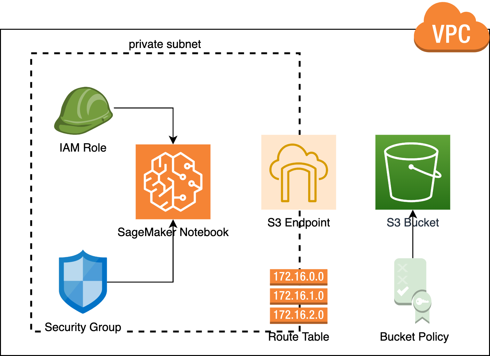

# A Stroll in the AWS Console

In this hands-on session you will get acquainted with the AWS Console, which offers a graphical user interface to interact with the different AWS service APIs. 

The goal is to build a minimal example of a (somewhat) secure environment for a data scientist / data engineer to explore new data in a jupyter notebook that lives in the Cloud. 

## Let's build it!

To access the AWS Console go to console.aws.amazon.com. Your instructor will provide you with login credentials. 
You will build the toy data exploration environment with the following AWS services:

### S3

1. Create an S3 bucket with a unique name, e.g. `a-stroll-in-the-aws-console-q7v`. You should not enable versioning of objects, but do make sure that the objects in the bucket are encrypted by default. AWS managed encryption is OK, but feel free to create your own keys with the AWS KMS service. Tag your bucket with the key-value pair `class: September2021`.
2. Upload some data (can be anything... If you don't have any inspiration, have a look at the [awesome-public-datasets repo](https://github.com/awesomedata/awesome-public-datasets)) to the bucket 

### VPC

1. Create a Virtual Private Cloud in the `eu-west-1` region (in case the class is large, you can use other regions as well to avoid hitting AWS service quotas). You have to specify the CIDR range of the VPC, i.e. the private IP addresses that will be available within your VPC. Choose any range that is large enough for at least two subnets (e.g. `10.1.0.0/24`). Make sure to tag your VPC with the key-value pair `class: September2021`. 
2. Create a public subnet within the VPC, i.e. a subnet which has a route table with a route entry to an Internet Gateway. Tag all the resources that you create (subnet, route table, internet gateway) with the same key-value pair as above. 
3. Create a default security group within your VPC that allows all traffic. Don't forget to tag it!

### IAM 

1. Create an IAM role that the notebook will use to read and write data from S3. The role should also allow the notebook to make use of all other AWS SageMaker subservices. 

### SageMaker 

1. Create a SageMaker notebook instance with the security group and IAM role that you just created attached and launch it in your public subnet. Do not give users `root` access to the Notebook! Enable `Direct internet access`. Don't forget to tag your notebook!
2. Open the Notebook and try to list the files in your S3 bucket. You can do this either by making use of the `boto3` python library, or via the AWS Command Line Interface (CLI), which is already installed on your notebook instance. If you don't have much python experience, using the CLI is probably the easiest. 

If you've made it this far, congratulations! Although relatively simple, this setup makes use of all the major components of a modern data platform: storage, networking, identity & access management, and compute. 

## Optional next steps

Now, for the second part, let's try to make it a bit more secure:

1. Create a private subnet within your VPC, i.e. a subnet that does not have a route to an internet gateway in it's route table. 

2. Create a VPC endpoint for the S3 service within your private subnet. That way instances within the private subnet can still access S3. 

3. Create a new notebook in that private subnet, and disable direct internet access. Check that you can still access your data in S3.

4. Attach a bucket policy to your S3 bucket that restricts downloading and uploading objects (i.e. `s3:putObject` and `s3:getObject` API calls) from the S3 VPC endpoint. Check that your notebook in the public subnet now no longer has access to the data you uploaded. 

The final architecture should look something like this: 

